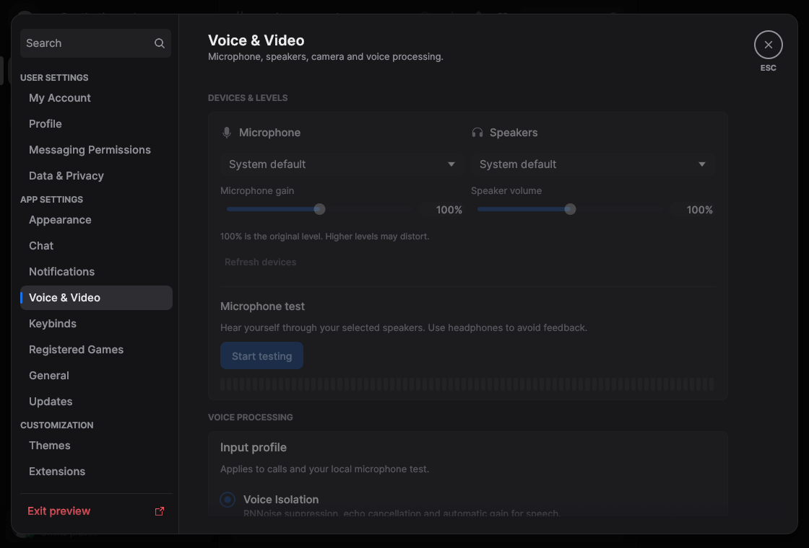
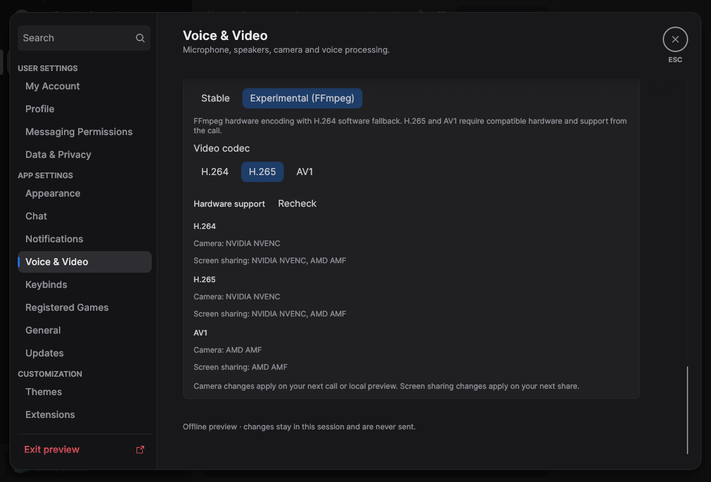
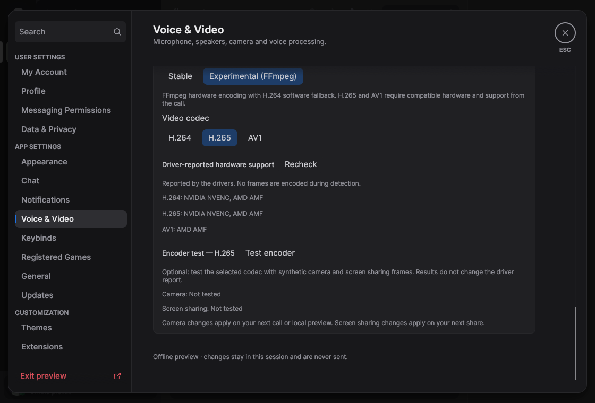
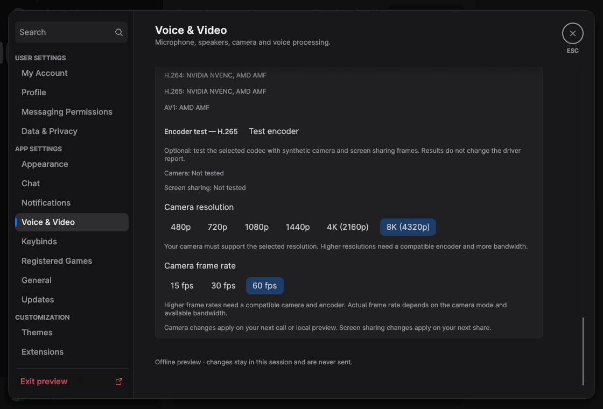
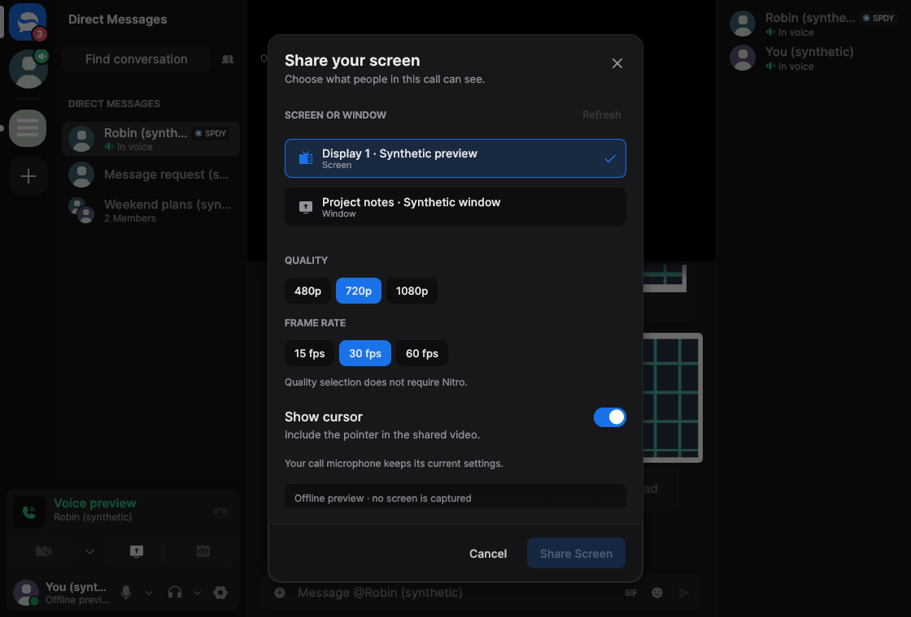
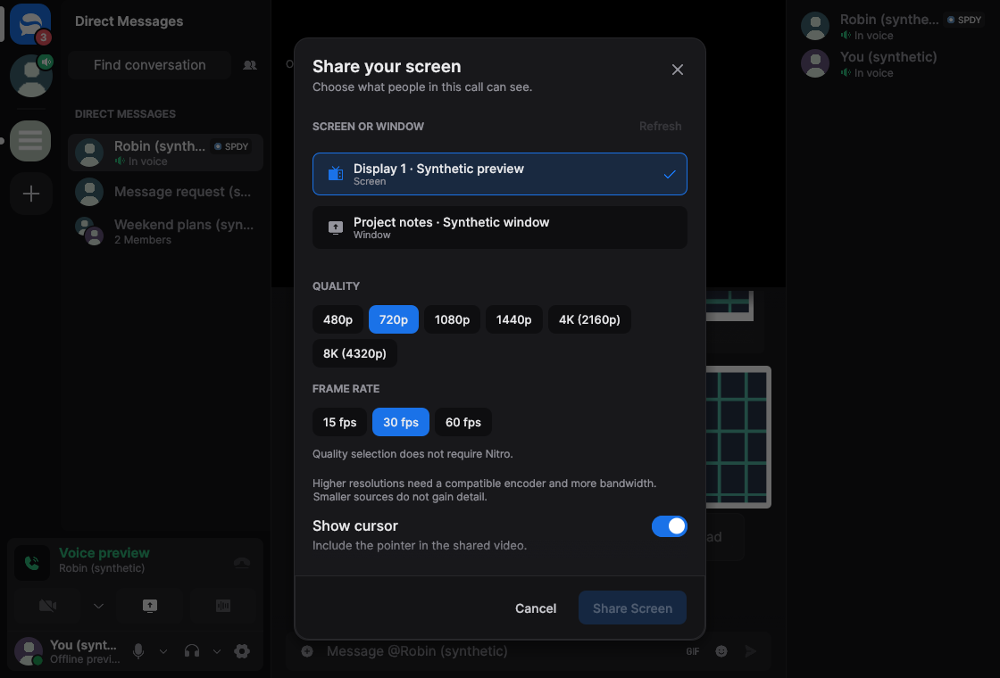

# Video encoding evidence for #567

This is the compact review record for FFmpeg encoding, hardware capabilities,
GPU routing and camera/screen presets. Current behavior is documented in
[Voice & Video](../../voice.md); this directory contains development evidence.

All captures and measurements below are **historical**, with their original
revision labels, source hashes and limitations. They do not validate the latest
PR head. The complete previous record remains in the
[commit-pinned archive](https://github.com/MCShotty/Serein/tree/faa9660761a2099cf2e6f5b748cf48bfa6871b63/docs/pr-evidence).
That commit identifies the archive snapshot, not every measured revision.

## Before / after

These inspected native egui/eframe captures use offline synthetic data, not a
Discord session or physical GPU/camera/screen. Positive capability rows are
explicit fixtures. Each image is below 2 MiB. The matched dark pairs use the
same default Inter font, 1120×760 viewport and 100% scale.

| Addition | Before | After |
| --- | --- | --- |
| Backend/codec selection |  |  |
| Driver queries and optional testing |  |  |
| Camera resolution / frame rate |  |  |
| Screen resolution |  |  |

The original backend pair starts at `65811f2`; it predates moving the controls
to the bottom of Voice & Video. The driver pair starts at
`16a09a986b73c7bf6abc3a80559ecdefb919c84a`. The 8K pairs start at
`623ef63514c1b68c516bc4b047503cead6b23511`. These illustrate separate stages,
not one before/after comparison against today's parent `main`.

The driver After and camera Before files were byte-for-byte identical; both
rows reuse the camera Before image. The camera pair is scrolled to the bottom
with Experimental/H.265; After selects 8K/60 fps. Both screen captures select
the same synthetic source and 720p/30 fps, showing the new available presets.
Sharing is disabled and no source is captured.

The retained [narrow/light camera](../video-8k-resolution/camera-narrow-light-after.png)
and [narrow/light screen](../video-8k-resolution/screen-narrow-light-after.png)
captures use 760×900 at 125% and 150% respectively. Camera controls wrap; the
screen picker body scrolls independently of its Cancel/Share footer. These
are auxiliary UI helpers excluding the production native desktop adapters.
The original capture commands, fixture definitions and verification records
remain in the archived
[backend](https://github.com/MCShotty/Serein/blob/faa9660761a2099cf2e6f5b748cf48bfa6871b63/docs/pr-evidence/video-backend-settings/README.md),
[driver](https://github.com/MCShotty/Serein/blob/faa9660761a2099cf2e6f5b748cf48bfa6871b63/docs/pr-evidence/video-driver-detection/README.md)
and [8K](https://github.com/MCShotty/Serein/blob/faa9660761a2099cf2e6f5b748cf48bfa6871b63/docs/pr-evidence/video-8k-resolution/README.md)
methods.

## Performance

[measurements.json](measurements.json) retains six original records without
changing their data: backend/software encoding, driver detection, 8K UI,
GPU-routing/software encoding, split-option setup and AMF split-request diagnostics.
Each record includes its
original path, file SHA-256 and immutable archive URL. Revision labels, samples,
environment, compiler/source identities and unmeasured fields are preserved.
Relative paths inside a record resolve in its archived original directory;
additional referenced build metadata and scripts remain there.

| Historical workload | Baseline | After | Delta / interpretation |
| --- | ---: | ---: | --- |
| Windows release executable, bytes | 86,008,832 | 86,554,112 | +545,280 |
| Windows installed package, bytes | 90,199,948 | 124,070,028 | +33,870,080 |
| Windows complete ZIP, bytes | 50,001,798 | 78,054,030 | +28,052,232 |
| FFmpeg software camera, 300 frames, median of five runs | 993.070 ms | 1,024.365 ms | +3.15%; overlapping ranges |
| Driver detection, median of five fresh processes | 262.167 ms | 265.354 ms | +1.216%; no hardware drivers available |
| 8K controls, sampled peak/settled UI RSS | 162,140,160 B | 163,909,632 B | +1,769,472 B; one helper pair |
| Split-option setup, median of five runs | 1,301.148 ms | 1,371.227 ms | +5.39%; overlapping ranges |

The Windows comparison is `1b3e4a7b` → `eefa0fe5`, Rust 1.98.1 on Windows 11
build 26200, Ryzen 7 7800X3D and 32 GiB RAM. Both standard releases include
voice and omit demo. Installed bytes sum every file in `dist`; ZIPs use .NET
`ZipFile.CreateFromDirectory` with Optimal compression. A stale cached xtask
omitted FFmpeg staging, so the recorded package was repaired by replaying
`packaging/ffmpeg/bundle.py`. All 241 non-executable files then matched their
expected sources. This is a portable directory/ZIP measurement, not a clean
end-to-end package rerun or an NSIS installer measurement. The complete
[Windows method and caveats](https://github.com/MCShotty/Serein/blob/faa9660761a2099cf2e6f5b748cf48bfa6871b63/docs/performance.md#windows-ffmpeg-integration-package---october-8-2026)
remain archived.

The software camera uses deterministic 640×480 RGB, 30-frame warmup and 300
timed calls, with one process warmup and five alternating pairs. Driver-query
timing uses actual detector/native code, one warmup and five alternating
fresh-process samples, with all nine NVENC/AMF/QSV codec paths unavailable.
The 8K UI helper uses software OpenGL, default camera preferences, six-second
warmup, 100 wheel events and fifteen one-second CPU/RSS samples per revision;
it performs no encoding or capture. Split setup allocates/configures/frees
60,000 HEVC/AV1 contexts at 1440p without opening encoders or drivers. Its
diagnostic FFmpeg build is not the standard distribution recipe.

These are separate workloads and recorded revisions. They establish neither
general speed/quality improvements nor current-head whole-app performance.
Helper sizes are not package sizes; sampled RSS is not a memory ceiling.
Physical 8K/60 fps, frame/startup p95, GPU memory and active hardware throughput
remain unmeasured in these records.

## Verification and reproduction

The evidence-only cleanup changes no runtime code, native tests, build recipe,
dependency, packaging or license files. The recorded split verification at
`faa9660` includes 464 UI tests, 140 scoped voice tests, selected strict Clippy,
native fixtures, packaging fixtures, login handoff and replay/soak. Full native
desktop/package validation is still separate from those scoped results.

Active regression fixtures remain in
[crates/discord-voice/tests/native](../../../crates/discord-voice/tests/native),
and source/license distribution remains in
[packaging/ffmpeg](../../../packaging/ffmpeg). Historical helper programs and
logs are archived rather than kept as additional active PR files. To inspect
the exact recorded methods without changing the task branch:

```sh
git worktree add --detach /tmp/serein-video-evidence faa9660761a2099cf2e6f5b748cf48bfa6871b63
```

Read that worktree's stage README and use each report's recorded revisions and
source identities. Some historical After states were uncommitted working trees
identified by hashes. The archive is not a promise that rerunning an old helper
against today's source reproduces its original measured binaries.

Fresh native screenshots are unavailable locally because no native window
capture tools are exposed. Full `cargo xtask check` / `cargo xtask package`
attempts were blocked by missing GLib development metadata. Native CI requires
maintainer approval; license/Wasm checks and fresh Windows/macOS/Linux packages
remain outstanding. The owner-reported vendor/native Discord tests precede
these extracted heads. No live account, microphone or capture test was run
for this evidence cleanup.
